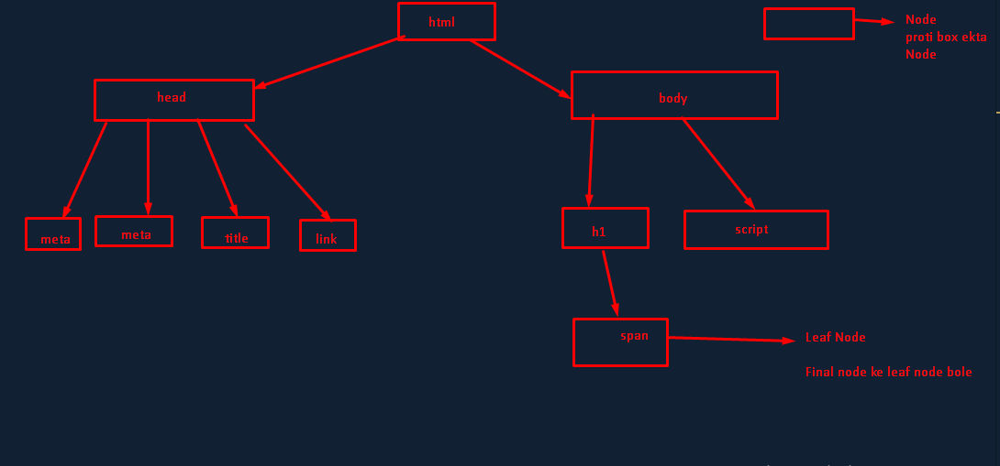

    ------------------------------------------------------------------    
                know about js Dom 01  <Start>
    -------------------------------------------------------------------

    // amra jani amder browser v8 engine ase , seta js chara kicu boze na
    // tahole html ,css kemne browser boze ?
    // html, css ke js convert kore then browser aeta run kore

    // interview question : 
    //how html , css run in browser ?

        // Dom Details 
        /***
        * D => Sei object Document format e save hoi 3
        * O => Tree Model object e Transfrom hoi 2
        * M => Model follow kore Tree Model 1
        * 
        * Tree Model Below
        */

    
    // What can dom do 
    /*
    it can crete js
    it can delete js
    it can upgrade js
    it can modify js
    it can add css also
    **/

    // Dom Details 
    /***
    * D => Sei object Document format e save hoi 3
    * O => Tree Model object e Transfrom hoi 2
    * M => Model follow kore Tree Model 1
    * 
    * 
    */
    // ==========================================
    // js er sob kicu window object e thake
    // winddow ke bole js er global object 
    // sob function and object ase 
    // console.log(window);
    //output ; Window {window: Window, self: Window, document: document, name: '', location: Location, …}

    console.log(window.document); // html tree pacci jekene head and body ase
    console.log(window.document.head); // meta , link , title
    console.log(window.document.head.children); 
    // node list / HTMLCollection(4) [meta, meta, title, link, viewport: meta]

    console.log(window.document.head.children[2]);  //title
    console.log(window.document.head.children[2].innerText);  // Document
    // so aeibabe ekta html er sobgulo element ke amra access korte pari 
    let x1 = window.document
    console.log(x1.links); //6ta link ase
    // Node list / HTMLCollection(6) [a, a, a, a, a, a]
    console.log(x1.links[3]) // <a href="#">happinig</a> 
    console.log(x1.links[3].innerText) // 3no index ki leka ase ta dekaw ==> happinig 
    console.log(window.document.forms[0].children); // 2ta children ase  label and input 

    console.log(window.document.forms[0].children[1]); 
    // children er 1 number index e input ase 
    console.log(window.document.forms[0].children[1].getAttribute("type"));  // input er type attr dicilam text

    console.log(window.document.forms[0].children[1].getAttribute("id")) // in

    console.log(window.document.forms[0].children[1].getAttribute("class")) // main

    console.log(window.document.forms[0].children[1].getAttribute("class")) // main

    console.log(window.document.forms[0].children[1].getAttributeNames()) //  ['type', 'id', 'class']
    // go to youtube and find 

    // how much link they have  . jehoto console kaj korben tai sekane arr console bola lage na . document.links

    // how much forms they have . document.forms[0].children[0].children[2].getAttributeNames()

    // ========================= how to access any element using tag name , id name  , 

    console.log(document.getElementsByTagName("h1")[0]); //     <h1>this is nishat</h1>
    console.log(document.getElementsByTagName("h1")[0].innerText); //    this is nishat
    // span ke dorte cie
    console.log(document.getElementsByTagName("h1")[0].children[0]); //    nishat
    console.log(document.getElementsByTagName("h1")[0].children[0].innerHTML); //  nishat

    // console.log(document.getElementsByTagName("a")[0]); //    <a href="#">Hello</a>
    // console.log(document.getElementsByTagName("a")[0].innerHTML); //   Hello

    // div kintu window.document dia dora jai na dorte hoi getelement dia ,
    // div jehoto tag tai 
    console.log(document.getElementsByTagName("div")[1].children[1].innerHTML); //nishat nishat nishat

    // alternative class name deo kora jai

    console.log(document.getElementsByClassName("first1")[0].children[1].innerHTML); //nishat nishat nishat
    // browser e run kore kore deken taile sob cea balo bozben
    console.log(document.getElementById("firstid").children[1].innerHTML); // nishat nishat nishat

    const id = document.getElementById("class2")
    const class1 = document.getElementsByClassName("class1")
    console.log(id); // js e same name e ekta id e newwa jai double nile sudu ektaai kaj korbe .
    console.log(class1); // HTMLCollection(2) [div.class1, div.class1]

    // so ekon aemon ekta way ase jar maddome sob tag eksate newwa jai 

    let All = document.querySelector(".first1")
    // obiously class er jonno Dot , id er jonno # , tag er jonno kicu na
    console.log(All);

    // jodi joto class ba id ba tag ase ta jante hoi taile use queryselectorAll 
    let All1 = document.querySelectorAll(".class1") 
    console.log(All1);

    // let All2 = document.querySelector("#class2") 
    // console.log(All2);
        

        
    const h2 = document.querySelector(".h2")
    h2.innerText = "Hello Nishat and Welcome to this Field  " // modify korte parcen 
    h2.classList.add("taufik") /// class o add korte parece 
    h2.style.backgroundColor = "red" // css o add korte parcen
    h2.classList.remove("taufik") // class del o korte parcen 

    // jodi id add korte hoto tokon 

    h2.setAttribute("id","taufik")  // id attribute taufik nam e add hoi gese h2 te 
    h2.setAttribute("class","taufiks")  // class attribute taufiks nam e add hoi gese h2 te 
    h2.setAttribute("type","taufik")  // type attribute taufik nam e add hoi gese h2 te 

    // class dia o add kora jai // set attribute dia o kora jai 
    // abr apni chan h2 te id add howwar sate sate setar css apply hok

    const h3 = document.querySelector(".h3")
    h3.setAttribute("id","heading")
    h3.setAttribute("class","text")
    h3.setAttribute("style","color:blue")

    // tag e css korte ciele dom dea koren 
    // arr jodi id/class e css korte chan taile css e jan 

    // ciele console "element" o crete kora jai mane tag lekar moto 

    const h1 = document.createElement("h1")
    h1.innerHTML = "MahmudurNishatIs"
    h1.setAttribute("class","Nishat")
    console.log(h1); //  <h1 class="Nishat">MahmudurNishatIs</h1>

    // body manne jekane amra sobkicu deki sekan kemne createElemnet kore dekano jai 
    // body te create kora element show korate parcen 
    //Ex-1
    const body = document.body
    const h1 = document.createElement("h1")
    h1.innerHTML = " Hello MahmudurNishat"
    h1.setAttribute("class","Nishat")
    body.appendChild(h1)
    console.log(h1);
    //Ex-2
    const h2 = document.createElement("h2")
    h2.innerHTML = " Welcome This Arena"
    h2.setAttribute("id","heading")
    body.appendChild(h2)
    console.log(h2);
    ------------------------------------------------------------------    
                know about js Dom 01  <End>
    -------------------------------------------------------------------